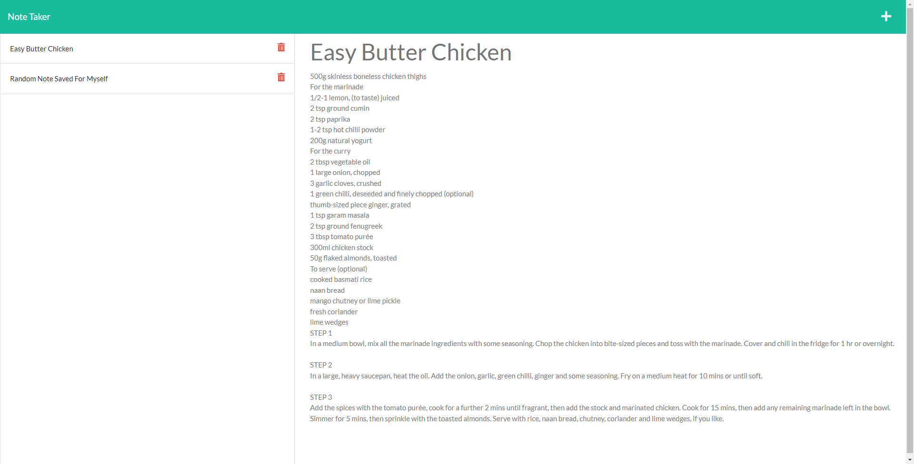

# Note Taker Starter Code

## Description

This site allows for a user to create notes and save them online for the rest of the world to see. The key component for allowing this to work was making use of the [express](https://expressjs.com/en/4x/api.html) node module. Another node module used is [uuid](https://github.com/uuidjs/uuid#readme) which allowed for each note to be assigned an id. 

Shown below is the site with one of the saved notes on display.



Express was used to create api endpoints in the back end for the front end to call upon for various functions. Shown below is the api end point that removed a note upon clicking the trash can next to it.

```js
app.delete('/api/notes/:id', (req, res) => {
    let currentNotes = JSON.parse(fs.readFileSync(__dirname + '/db/db.json'));
    for (let i = 0; i < currentNotes.length; i++) {
        if(currentNotes[i].id == req.params.id) {
            currentNotes.splice(i, 1);
        }
    }
    fs.writeFile(`./db/db.json`, JSON.stringify(currentNotes, null, '\t'), (err) => err ? console.error(err) : res.send('success'));
})
```

UUID allowed for each note to be assigned an id that would be created in the back end when a post request was made to append a new note. 

```js
app.post('/api/notes', (req, res) => {
    let note = req.body;
    note.id = uuidv4();
    let currentNotes = JSON.parse(fs.readFileSync(__dirname + '/db/db.json'));
    currentNotes.push(note);
    fs.writeFile(`./db/db.json`, JSON.stringify(currentNotes, null, '\t'), (err) => err ? console.error(err) : res.send('Success'));
})
```

## Deployed Site

[Link to deployed heroku site](https://stark-sierra-36660.herokuapp.com/notes)

## Technologies Used

- [Node JS](https://nodejs.org/dist/latest-v16.x/docs/api/)
- [Visual Studio Code](https://code.visualstudio.com/)
- [Github](https://github.com/)
- [Express](https://expressjs.com/en/4x/api.html)
- [UUID](https://github.com/uuidjs/uuid#readme)
